# Gestor de contraseñas - Kevscl

_Este proyecto es un gestor de contraseñas diseñado para almacenar y gestionar de manera segura información sensible, como contraseñas y datos de acceso a sitios web. Las contraseñas se cifran utilizando un certificado X.509 generado por el propio usuario y se almacenan en una base de datos SQLite para garantizar la seguridad y la accesibilidad._

## Comenzando 🚀

_Estas instrucciones te permitirán obtener una copia del proyecto en funcionamiento en tu máquina local para propósitos de desarrollo y pruebas._

Mira **el readme** para conocer como ejecutar el proyecto.
```
git clone https://github.com/KevinGil12C/GestorClaves
```

### Pre-requisitos 📋

_Antes de continuar debes contar con el JDK 19.0.2 de Java_

```
Puedes encontrar el instalador en: https://www.oracle.com/java/technologies/javase/jdk19-archive-downloads.html
```

### Instalación 🔧

_Sigue los pasos a continuación para ejecutar el gestor de contraseñas en tu sistema._

#### Abrir la terminal o consola

_Navega hasta el directorio donde se encuentra el archivo descargado GestorClaves.jar._
```
cd ruta/path/GestorClaves/GestorClaves.jar
```

#### Ejecutar el programa

_Asegúrate de tener instalado Java en tu sistema (recomendado Java 19 o superior). Luego, ejecuta el siguiente comando para iniciar la aplicación_
```
java -jar GestorClaves
```

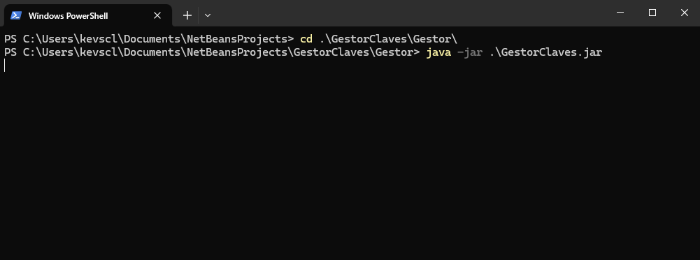

#### Uso de la aplicación

_Una vez iniciado, podrás gestionar tus contraseñas a través de la interfaz gráfica que se abrirá automáticamente._
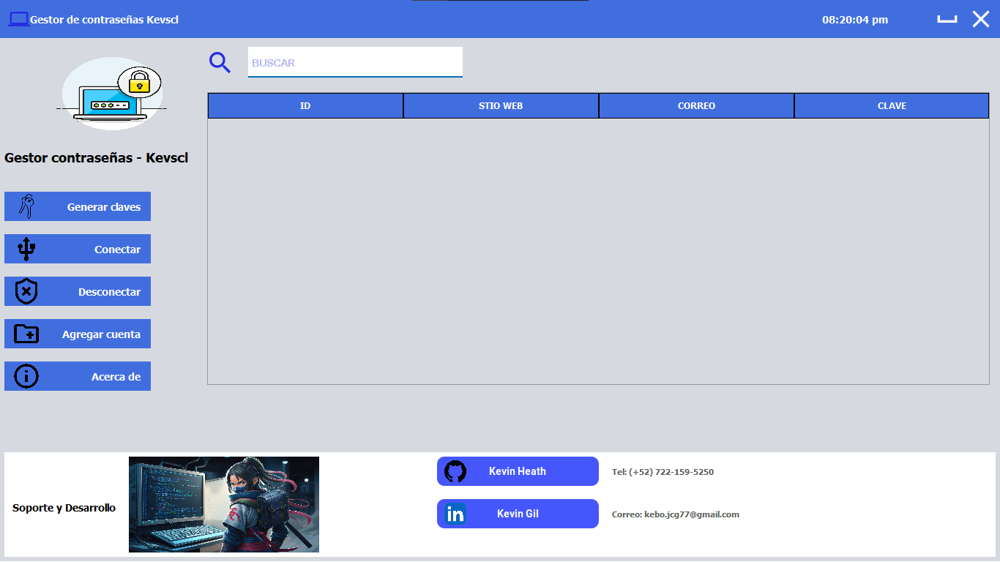


## Ejecutando las pruebas ⚙️

_A continuación se muestra un manual detallado para los botones de la aplicación de gestor de contraseñas:_

### Generar claves 🔑

<li>Al hacer clic en este botón, se abrirá el repositorio donde se encuentran las instrucciones para generar un certificado y una clave privada.</li>
<li>Sigue los pasos indicados en ese repositorio para crear un certificado X.509 y la clave privada correspondiente, necesarios para poder descifrar las contraseñas almacenadas.</li>

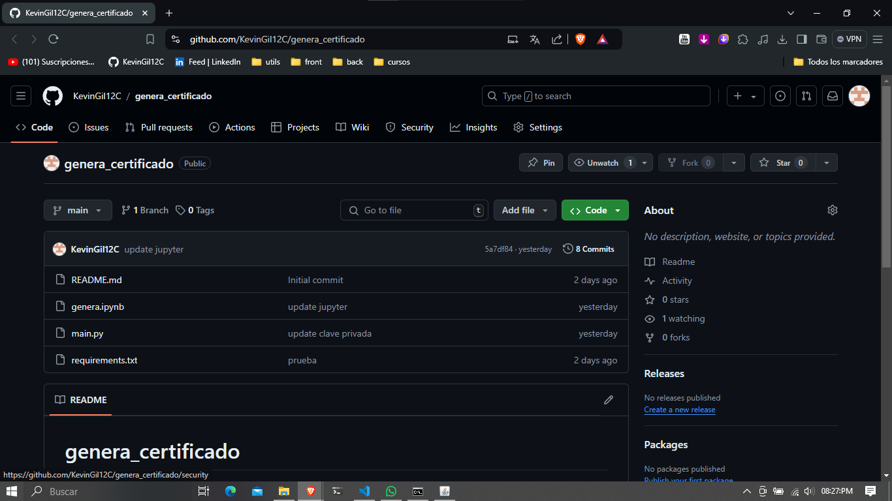


### Conectar 🔒
 <li>Este botón abre un explorador de archivos para que selecciones el certificado y la clave privada que generaste previamente.</li>
 <li>Después de seleccionar los archivos, el sistema te pedirá la contraseña con la que se creó la clave privada.</li>
 <li>Al ingresar correctamente la contraseña, las contraseñas almacenadas en la tabla se descifrarán y podrás verlas en texto claro.</li>

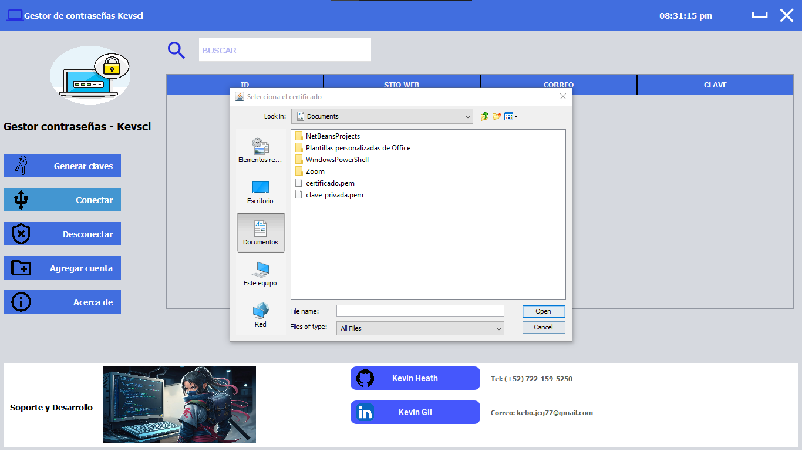
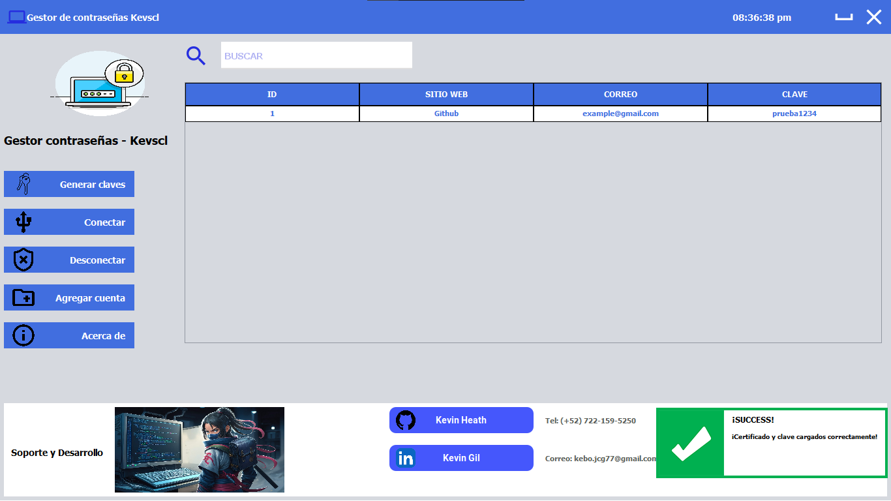

### Desconectar 🚫
<li>Al hacer clic en este botón, la conexión se cerrará, poniendo el certificado y la clave privada en null.</li>
<li>Esto hará que las contraseñas vuelvan a mostrarse en su forma cifrada en la tabla.</li>

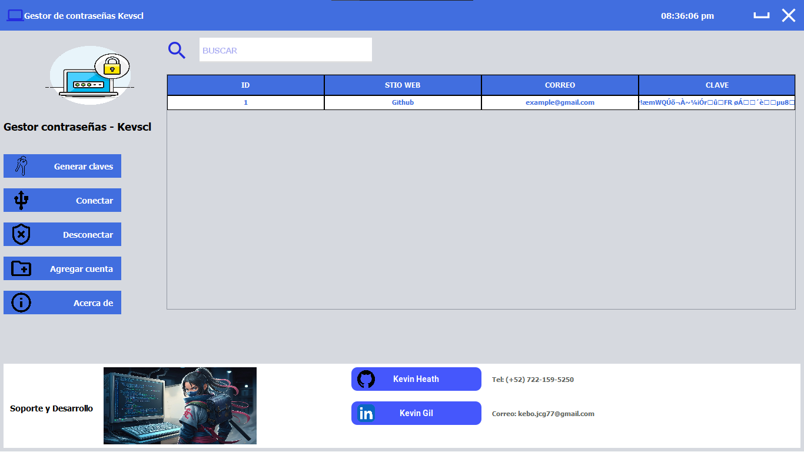


### Agregar cuenta ➕
<li>Este botón abre un nuevo formulario (JFrame) donde podrás ingresar los datos de una nueva cuenta (sitio web, correo, contraseña).</li>
<li>Al llenar los datos y confirmar, la nueva cuenta se agregará a la tabla y será almacenada de forma cifrada.</li>

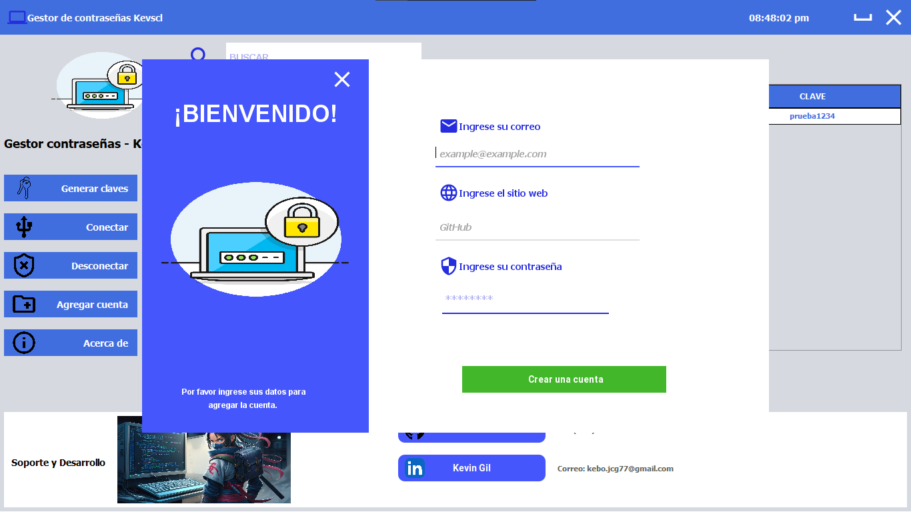

### Acerca de 
<li>Abre un panel con la información "Acerca de" la aplicación, donde se explica brevemente su funcionalidad y propósito, así como los créditos.</li>

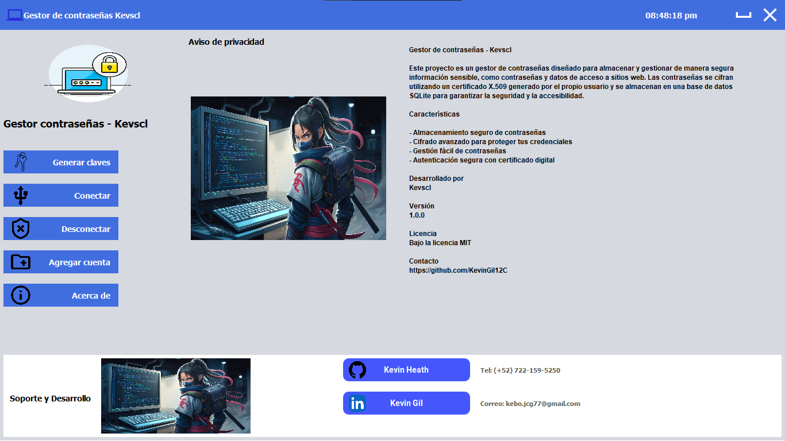

### Interacción con la tabla 📋
<li>Al hacer clic en una fila de la tabla, se habilitarán dos botones adicionales:</li>

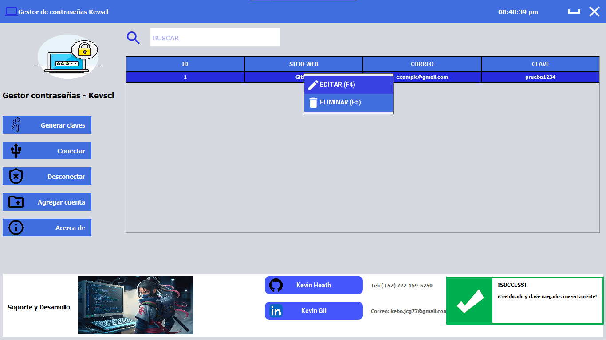

###### Editar ✏️
<li>Al hacer clic en este botón, se abrirá un nuevo formulario (JFrame) donde podrás editar los datos de la cuenta seleccionada. Podrás modificar el sitio web, el correo o la contraseña. Al confirmar, los cambios se guardarán y la tabla se actualizará.</li>

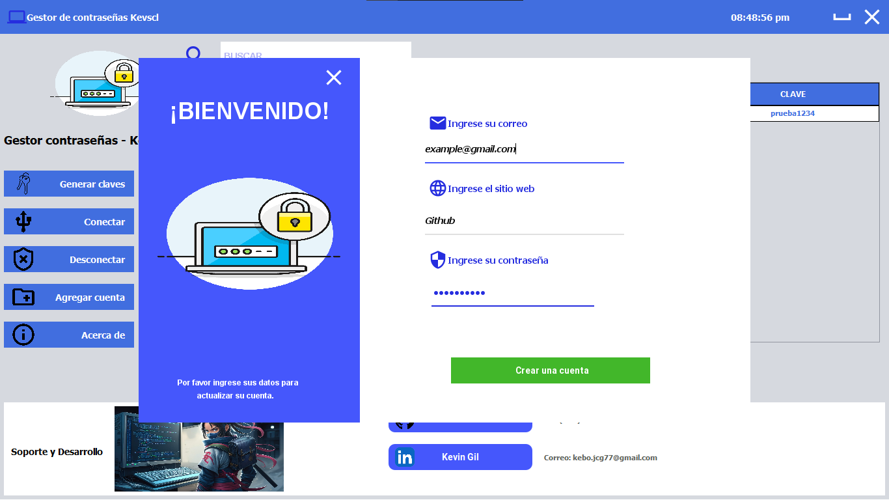

###### Eliminar 🗑️
<li>Al hacer clic en este botón, se abrirá un cuadro de diálogo (JOptionPane) que te pedirá confirmación para eliminar la cuenta seleccionada. Si confirmas, la cuenta se eliminará de la tabla y de la base de datos.</li>

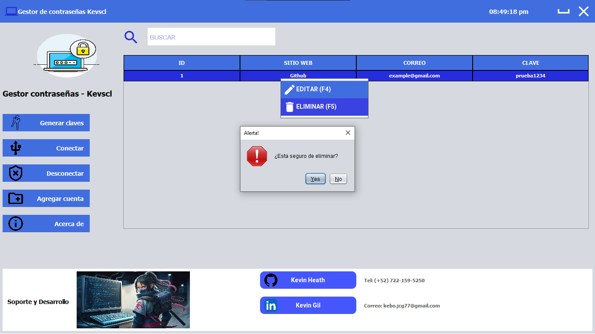

## NOTA: Se pueden hacer busquedas por sitio web o correo.

## Construido con 🛠️

_Estas son las principales herramientas utilizadas para desarrollar el proyecto:_

<li>Java JDK 19 - Lenguaje de programación y entorno de desarrollo para la aplicación.</li>
<li>NetBeans - Entorno de desarrollo integrado (IDE) utilizado para el diseño de la interfaz gráfica y la gestión del proyecto.</li>
<li>SQLite - Sistema de base de datos usado para almacenar de forma local las cuentas y contraseñas cifradas.</li>
<li>JDBC (Java Database Connectivity) - Biblioteca para la conexión y manipulación de la base de datos SQLite.</li>
<li>Cryptography - Librería de Python utilizada para generar y gestionar las claves privadas y certificados X.509.</li>
<li>JOptionPane - Utilizado para mostrar diálogos de confirmación y alertas en la interfaz gráfica.</li>


## Autores ✒️

_Creado por_

* **Kevscl** - *Trabajo Inicial* - [GitHub](https://github.com/KevinGil12C)


## Licencia 📄
Este proyecto está bajo la Licencia MIT - mira el archivo [LICENSE.md](LICENSE.md) para detalles

## Expresiones de Gratitud 🎁

* Comenta a otros sobre este proyecto 📢
* Invita una cerveza 🍺 o un café ☕ a alguien del equipo. 
* Da las gracias públicamente 🤓.


---
⌨️ con ❤️ por [KevinGil12C](https://github.com/KevinGil12C) 😊